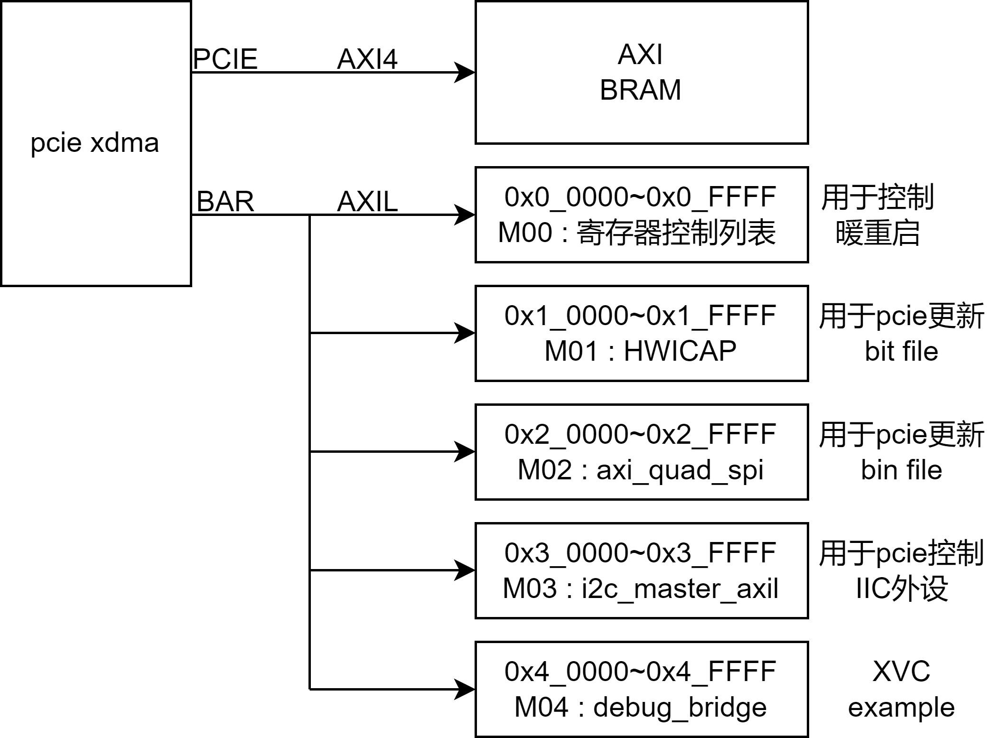
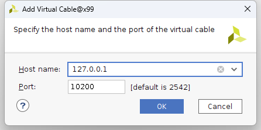
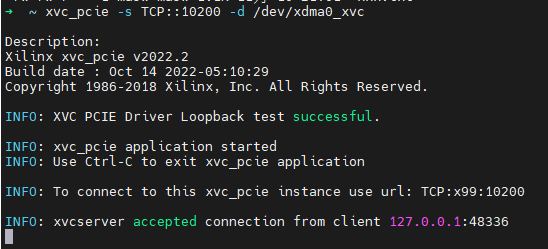
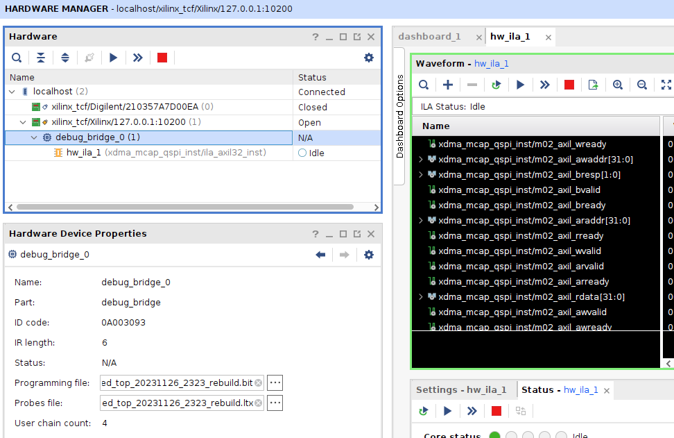

## 总体架构




### 1. XVC debug bridge example

工程example中，配置了 AXI debug bridge 的地址为  `0x4_0000` , 这个地址与xdma的驱动 /dev/xdma0_xvc的默认地址一致

上位机安装xdma驱动后，会自带 /dev/xdma0_xvc , 另外vivado的路径里会带有一个 xvc_pcie, 如果已经将vivado的路径添加到了PATH中，则可以任意路径下执行 

```shell
#初始化 xvc服务
xvc_pcie -s TCP::10200 -d /dev/xdma0_xvc &
```

即可在vivdao中使用xvc, 









* 一些额外的notes: 如果你把AXI bridge 挂在的AXIL地址不是0x4_0000，而是0x5_0000, 则需要重新编译/安装驱动并重启xdma.ko。 本example中使用了默认的0x40000地址

```shell
cd dma_ip_drivers/XDMA/linux-kernel/xdma/
sudo make xvc_bar_offset=0x50000
sudo make install 
```


### 2. hwicap 上位机更新 bit

驱动debug中


### 3. AXI QSPI 上位机更新 bin

驱动debug中, 上位机读写QSPI扇区已通，形成脚本还需要点时间


