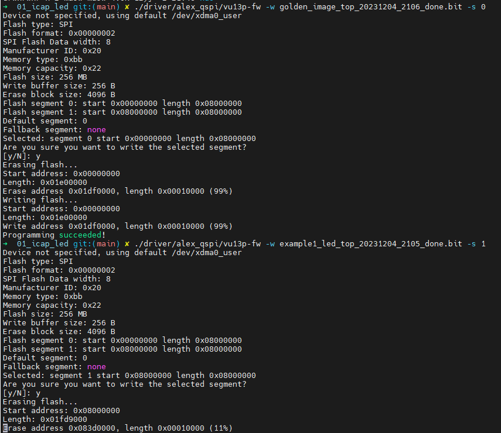
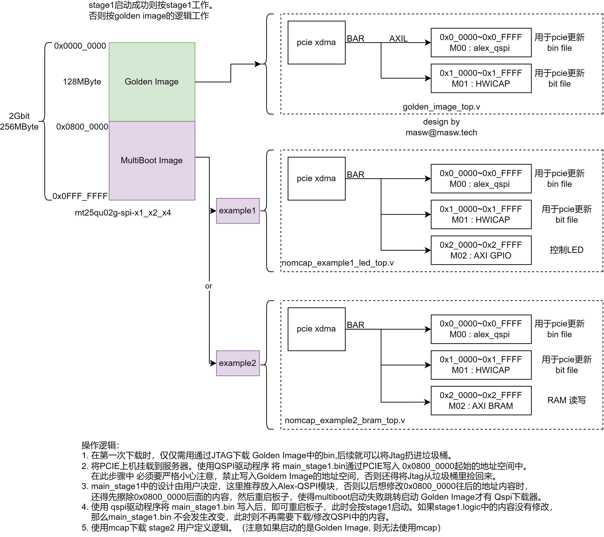

## Step 1  编译FPGA

3个FPGA工程一起编译（自己CPU不够强的话可以分开编译，不带 ```-j4``` 参数即可）


```shell
cd vu13p/prj/01_icap_led
make -j4 tag=hello_masw
# CPU 起飞
```

编译结束后会在 `~/alivu13p/prjs/golden_images` 目录下生成三个工程的xpr文件。并且在当前目录下会出现3个bit文件


## Step 2  编译QSPI-FLASH驱动

```shell
cd vu13p/prj/01_icap_led/driver/alex_qspi
make
```

会在当前目录下生成一个 vu13p-fw 软件

```shell
➜  alex_qspi git:(main) ✗ ./vu13p-fw -h
usage: vu13p-fw [options]
 -d name    device to open (default: /dev/xdma0_user)
 -s slot    slot to program
 -r file    read flash to file
 -w file    write and verify flash from file
 -e         erase flash
 -b         boot FPGA from flash
 -t         hot reset FPGA
 -y         no interactive confirm
```

下载bit文件到FPGA

```shell
./vu13p-fw -w xxxxxxxx.bit -s 0 # 0代表是QSPI flash的第0个扇区
./vu13p-fw -w xxxxxxxx.bit -s 1 # 1代表是QSPI flash的第1个扇区
```



## Step 3 实验验证

总体结构




### 3.1 led 测试

```
cd driver/test_led
make 
# 确认已经启动了 led 的 fpga固件
./led
# 可以看到 led 闪烁
```


### 3.2 bram 测试


```
cd driver/test_bram
make 
# 确认已经启动了 bram 的fpga 固件
./bram
```


### 3.3 XVC 测试


工程example3中，配置了 AXI debug bridge 的地址为  `0x2_0000` , 这个地址与xdma的驱动 /dev/xdma0_xvc的默认地址`0x4_0000`并不一致

上位机安装xdma驱动后，会自带 /dev/xdma0_xvc , 另外vivado的路径里会带有一个 xvc_pcie, 如果已经将vivado的路径添加到了PATH中，则可以任意路径下执行 

```shell
#初始化 xvc服务
xvc_pcie -s TCP::10200 -d /dev/xdma0_xvc &
```

即可在vivdao中使用xvc, 


* 需要加载 probes file 才会有ila的波形显示。

* 一些额外的notes: 如果你把AXI bridge 挂在的AXIL地址不是0x4_0000，而是0x2_0000, 则需要重新编译/安装驱动并重启xdma.ko。 

```shell
cd dma_ip_drivers/XDMA/linux-kernel/xdma/
sudo make xvc_bar_offset=0x20000
sudo make install 
```


