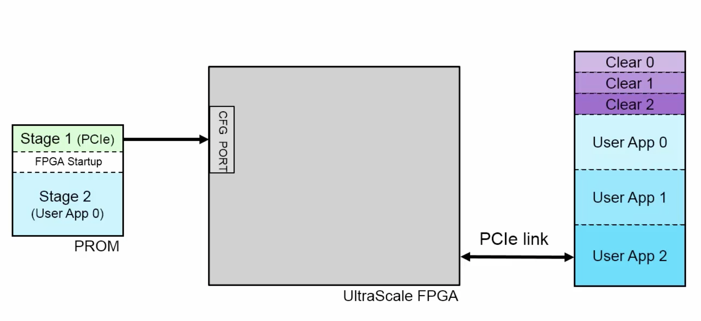
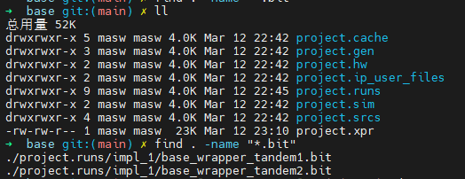
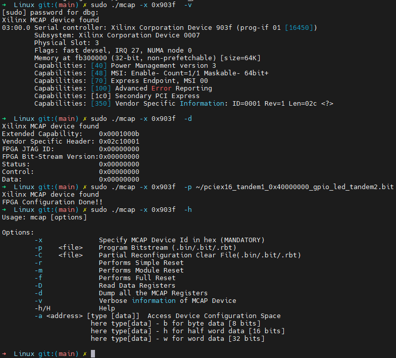
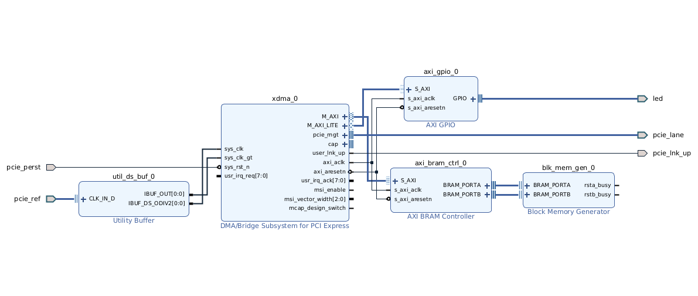
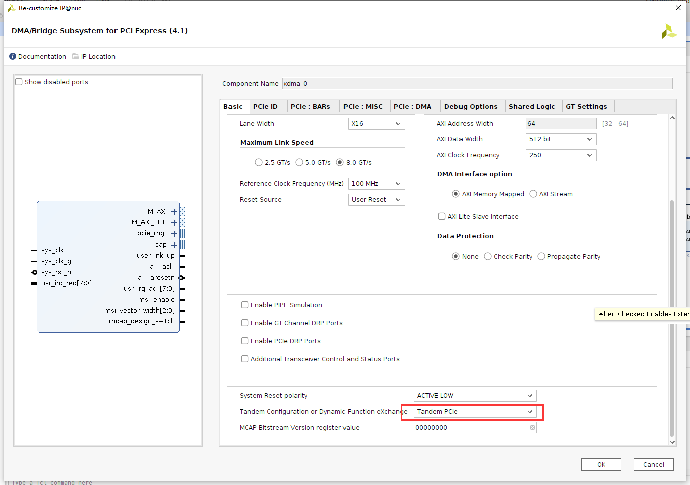
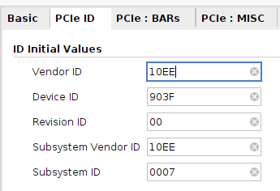
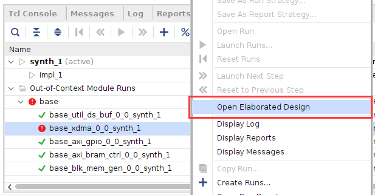

# 关于 Tandem PCIe

PCI Express® 属于即插即用协议，即上电时，PCIe® 主机将枚举系统。在此流程中，主机将从每个器件读取请求的地址 大小，然后向器件分配基址。因此，当主机查询 PCIe 接口时，这些接口必须处于就绪状态，否则不会为其分配基址。 PCI Express 规范声明，当系统电源正常的 100 ms 后，PERST# 必须断言无效，并且在 PERST# 断言无效后的 20 ms 内 PCI Express 端口必须准备好进行链路训练。这通常被称为 100 ms 启动时间要求。

“Tandem Configuration”(串联配置)使用 2 阶方法以支持 IP 满足 PCI Express 规范中所述的配置时间要求。此技术 支持多种用例，如下所述:

* “Tandem PROM”(串联 PROM):从闪存加载单一 2 阶比特流。
* “TandemPCIe”(串联PCIe):从闪存加载第一阶段比特流，并通过PCIe链路将第二阶段比特流交付至 MCAP。
* “Tandem PCIe with Field Updates”(含现场更新的串联 PCIe):完成串联 PCIe 初始配置后，在 PCIe 链路保持
有效时更新整个用户设计。更新区域(布局图)和设计结构均已预定义，并且已提供 Tcl 脚本。

* 串联 Dynamic Function eXchange:这是较常用的用例，针对任意大小或任意数量的动态区域采用串联配置后接
Dynamic Function eXchange (DFX)。
* “DFX over PCIe”(基于 PCIe 的 DFX):这是标准配置，后接 DFX，使用 PCIe / MCAP 作为部分比特流的交付

根据特定用例，更改“Tandem Configuration or Dynamic Function eXchange”(串联配置或 Dynamic Function
eXchange)选项:
* “Tandem PROM”适用于串联 PROM 用例。
* “Tandem PCIe”适用于串联 PCIe 或串联和 Dynamic Function eXchange 用例。
* “Tandem PCIe with Field Updates”则仅适用于预定义的“Field Updates”用例。
* “DFX over PCIe”用于为 DFX 启用 MCAP 链路，而无需启用“Tandem Configuration”。


## 1 原理

Tandem PCIe 将传统的单一bit流分割成2个部分。第一部分仅仅包含必要的pcie相关逻辑(Stage 1)，第二部分包含用户App相关逻辑(Stage 2)


如下图所示：



在tcl脚本中增加如下两行，即可把单一bit分割为两个部分，分别用于stage 1 和stage 2

```tcl
set_property HD.OVERRIDE_PERSIST false [current_design]
set_property HD.TANDEM_BITSTREAMS Separate [current_design]            
```

对于FPGA服务来说，出厂即会设定好Stage 1相关内容并把该部分逻辑硬化成dcp文件，二次开发用户调用pcie模块，再通过mcap程序下载即可

####  编译后,固化tandem1

编译后即可生成 2个 bit文件：



其中tandem1.bit 可以使用tcl命令生成bin 

```tcl
# vu13p only : 请注意使用绝对路径 替换 xxxx的名字
write_cfgmem -format bin -size 256 -interface SPIx4 -loadbit {up 0x00000000 "xxxxxx_tandem1.bit" } -file "xxxxxxxxxx_tandem1.bin"
```

生成bin 文件后通过 jtag 将bin文件下载至flash中 (02g_x1_x2_x4)

下载完成后请对pcie板卡进行冷重启。

####  下载 tandem2.bit

本文档仅验证过linux5.15 on Ubuntu20环境; 首先安装依赖

```shell
# 1. 依赖
sudo apt install zlib1g
# 2. 安装 pcieutils
cd driver/driver/an64761/pcieutils
cat get_pcieutils.sh
source get_pcieutils.sh
# 3. 安装mcap
cd ../Linux
cat compile.sh
source compile.sh
./mcap -h
```

安装OK后查看：



## 2. 以led驱动为例

这里以led驱动为例，设计一组tandem pcie 样例


```shell
# 打开工程
cd prj/01_mcap_led
vivado -mode batch -source project.tcl
```
工程打开后如下所示 ： 


然后使用tcl脚本编译工程：
```tcl
#. 开始编译 
launch_runs synth_1 -jobs 8
wait_on_run synth_1

# 生成bin/bit文件
set_property STEPS.WRITE_BITSTREAM.ARGS.BIN_FILE true [get_runs impl_1]

# 布局布线
launch_runs impl_1 -to_step write_bitstream -jobs 8
wait_on_run impl_1

# 开启GUI
start_gui

```

#### 如果希望手动配置，则注意一下配置细节

1. 选择串行 Tandem PCIe



2. Device ID 



3. 如有syn不过的模块可以打开Elaborated




## 3. 做一个固定pcie dcp

只要后续工程都使用用一个pcie模块的dcp文件，均可通过pcie下载程序代码。


## 4. 调用固定的pcie模块


## 5. 驱动
