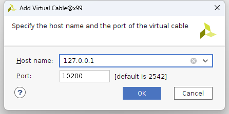
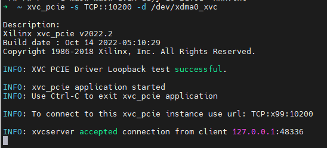
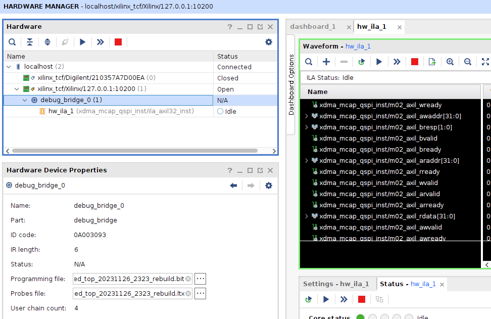

# 使用

##  通过 pciutils 安装好 mcap 工具
  * `cd driver/an64761/pcieutils`
  * `./get_pciutils.sh`
  * `cd driver/an64761/Linux`
  * `./compile.sh` 获得 mcap工具

## 使用mcap 烧写程序

```
➜  Linux git:(main) ✗ lspci | grep Xilinx
03:00.0 Serial controller: Xilinx Corporation Device 903f
➜  Linux git:(main) ✗ sudo ./mcap -x 903f
Xilinx MCAP device found
➜  Linux git:(main) ✗ sudo ./mcap -x 0x903f -p ../../../../../alivu13p/prj/02_pcie_ddr4x3_streamloop/alivu13p_top_notag_tandem2.bit 
Xilinx MCAP device found
FPGA Configuration Done!!
```

## 安装驱动

```
cd dma_ip_drivers/XDMA/linux-kernel/XDMA
make 
sudo make install 
cd dma_ip_drivers/XDMA/linux-kernel/tests
sudo ./load_driver.sh
```


## 测试

### 测试DDR速度

```
cd driver/ddr4test/ 
make 
➜  ddr4test git:(main) ✗ make
./testddr4x3
写入16GB内存的速度为: 6.442451 GB/s
读出16GB内存的速度为: 6.442451 GB/s
正在比对0x000000000 ~ 0x040000000中的内容, 比对完成
正在比对0x040000000 ~ 0x080000000中的内容, 比对完成
正在比对0x080000000 ~ 0x0c0000000中的内容, 比对完成
正在比对0x0c0000000 ~ 0x100000000中的内容, 比对完成
正在比对0x100000000 ~ 0x140000000中的内容, 比对完成
正在比对0x140000000 ~ 0x180000000中的内容, 比对完成
正在比对0x180000000 ~ 0x1c0000000中的内容, 比对完成
正在比对0x1c0000000 ~ 0x200000000中的内容, 比对完成
正在比对0x200000000 ~ 0x240000000中的内容, 比对完成
正在比对0x240000000 ~ 0x280000000中的内容, 比对完成
正在比对0x280000000 ~ 0x2c0000000中的内容, 比对完成
正在比对0x2c0000000 ~ 0x300000000中的内容, 比对完成
```

### ila 测试

```
#初始化 xvc服务
sudo xvc_pcie -s TCP::10200 -d /dev/xdma0_xvc &
```
即可在vivdao中使用xvc, 








* 需要加载 probes file 才会有ila的波形显示。

* 一些额外的notes: 如果你把AXI bridge 挂在的AXIL地址不是0x4_0000，而是0x2_0000, 则需要重新编译/安装驱动并重启xdma.ko。 

```shell
cd dma_ip_drivers/XDMA/linux-kernel/xdma/
sudo make xvc_bar_offset=0x20000
sudo make install 
```

### DMA 环回测试


