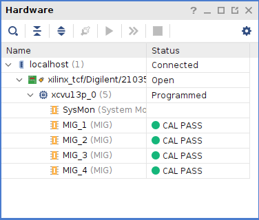

## 编译工程。

```shell
make
```

工程文件默认位置位于

```
~/alivu13p/xdma_ddr4x4
```


## 02_pcie_ddr4x4

* 总体结构


* 地址分配

ddrc0 : 0x0_0000_0000

ddrc1 : 0x1_0000_0000

ddrc2 : 0x2_0000_0000

ddrc3 : 0x3_0000_0000
	
* MIG OK

 


## NOTES

```
重要提示!赛灵思建议串联配置用户避免将 bank 65 用于设计应用(尤其是在使用串联 PROM 时),
以避免复  杂操作,因为编程比特流分为 2 个阶段。需明确说明的是,Memory Interface Generator (MIG) 所构建的 IP 核
不得使用 bank 65 I/O。这样可以确保 IP 完全保留在阶段 2 中,并避免因其嵌入式 I/O 和严苛的时序约束而导 致产生复杂结果。
```
基于以上情况，如果要使用tandem PCIe 或者，则c3 的DDR4是废的。这个工程仅仅用于测试DDR的可用性。

