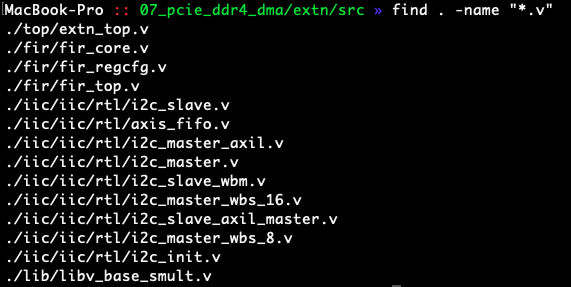
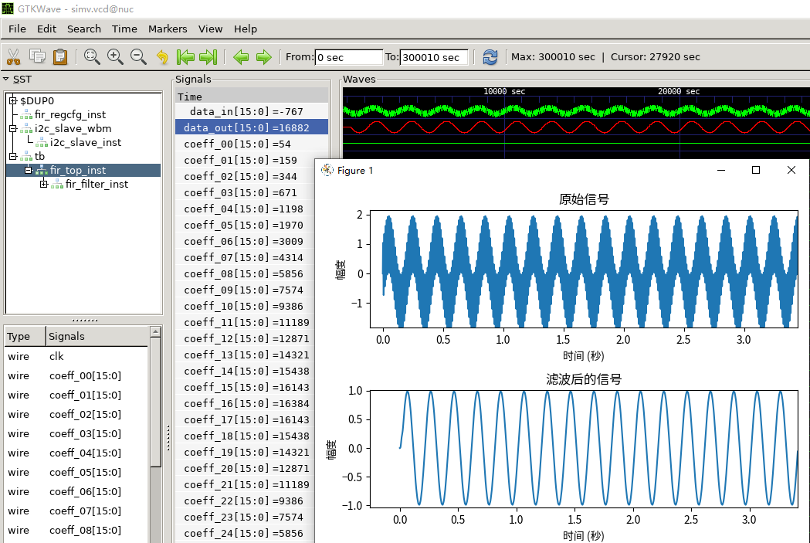

# 07 PCIE + DDR4 + DMA + DUT

NOTES : 本项目还没开发完，未处于Release状态，还不能直接用


## 总体结构

本节利用VU13P 设计一个基本框架，用于加速验证自己的逻辑。
在一般的验证场景，依靠 iverilog + GTKWave 已经能够满足大部分功能性验证。
对于一些需要较长仿真时间的case, 尤其是涉及到性能仿真，纯软件仿真器不能满足实际要求。
通常的做法是在FPGA平台上做验证，传统的FPGA平台需要频繁调试硬件相关bug, 极大地耗费不必要的时间。
本项目基于稳定可靠的VU13P 硬件平台，直接插卡到PCIE接口中，简单可靠。无需关心硬件问题。
基于这样的思路，设计一组DUT实验平台如下


一般来说，一个DUT需要激励源以及信宿，通常情况下， 还需要一组逻辑分析仪探测内部信号状态。一些逻辑单元，还需要SPI/IIC/等控制内部寄存器的接口。如上图所示


### 实现架构

基于上述的需求，构思基本框架


上面共使用了VU13P板卡的3个通道DDR内存，均用于DMA搬移内存数据。
1. channel1 - Source 通道的DDR4内存共4GB， 由上位机通过PCIE接口持续搬运数据到DDR4中，并且由DMA模块从DDR4中相对于低速(低于200MB/s)地搬运数据到DUT
2. channel2 - Sink   通道的DDR4内存共4GB， 由DUT输出数据流送给DMA模块，由DMA负责搬运数据到DDR4， 上位机根据DMA模块的中断请求读取channel2 DDR4中的数据
3. channel3 - LA     通道的DDR4内存共4GB， 由DUT输出内部数据流送给DMA模块，由DMA负责搬运数据到DDR4， 上位机根据DMA模块的中断请求读取channel3 DDR4中的数据
4. channel4 - DDR4   通道在本项目中没有被使用，该通道是预留给DUT的，一些RV CPU内核需要使用外部的DDR4。

### 软硬件结构

如图所示，本项目提供的软硬件结构如下


1. 应用层，提供MATLAB、gnuradio、Sigrok、python使用案例，提供QT界面控制内部寄存器列表。
2. 驱动层，使用c/c++编写，调用官方库，并提供API接口给应用层。
3. 官方库，一些基本库。
4. IP层  ，一些基本IP。
5. 框架层，由`prj/07_pcie_ddr4_dma/base`提供基本框架
6. 代码层，由用户编写。

### 开发流程


开发流程如上图，
1. 首先需要做一个简单的XDMA IP (参考`prj/00_pcie_only`) 编译生成xdma_base.dcp文件, 由于后续需要使用mcap下载增量编译bit文件，必须使用同一个pcie模块才可以使用。
2. 编译生成base库，生成base.dcp增量编译文件, 避免多次重复编译极其耗时的DDR4、DMA、XDMA模块。
3. 使用`iverilog`仿真自己的代码 参考 `prj/07_pcie_ddr4_dma/extn/sim/`
4. 编译
5. 首次编译需要通过Jtag将Tandem1.bit 固化到PROM中，后续仅通过pcie下载代码。
6. 使用在上位机查看代码内部逻辑。
7. 迭代修改代码
8. 反回3


## let's Goooooooooooo

### 设计代码

不多说，直接使用ChatGPT-4做一个FIR滤波器作为示例

```verilog
//  Model: GPT-4
//  
// Q 用Verilog 写一个FIR 滤波器，其中输入输出端口的位宽为16bit, 一共33个系数，每个系数的位宽也都是16bit, 并且系数位宽可通过端口配置
//  
// A  根据你的要求，下面是一个基于Verilog的FIR滤波器的实现。它有16位宽的输入和输出端口，33个16位宽的系数，且系数位宽可以通过端口配置。
//      
// Q 输入信号data_in是有符号数，直接使用乘法符号 * 并不正确，应该增加一个子模块，专门处理乘法，或者调用xilinx ultrascale plus 乘法器原语。另外 加法树太长了，应当在加法树处增加寄存器打拍
//          
// A 你的建议是非常合理的。针对有符号数的乘法，我们可以使用专门的乘法子模块。这里我为你提供一个基于Xilinx UltraScale+ FPGA的有符号数乘法器原语DSP48E1的实现。
//  
// Q 我希望在累加器处每4个加法打一拍。
//  
// A 根据您的要求，我们可以在累加器处每4个加法后添加一个寄存器。以下是修改后的FIR滤波器模块：
//  verilog
module fir_core (
    input wire         clk     ,
    input wire         rst     ,
    input wire  [15:0] data_in , 
    input       [15:0] coeff_00,
    input       [15:0] coeff_01,
    input       [15:0] coeff_02,
    input       [15:0] coeff_03, 
    input       [15:0] coeff_04,
    input       [15:0] coeff_05,
```


用python设计一个激励源以及DUT，直接让AI帮写, 详见文件`prj/07_pcie_ddr4_dma/extn/sim/gensource.py`
```python
#---Model: GPT-4
#---
#---用python 产生两个正弦波相加的信号，并设计一个33个系数的FIR滤波器滤除高频信号
#---要使用Python生成两个正弦波相加的信号并设计一个具有33个系数的FIR滤波器以滤除高频信号，您可以使用以下库和代码：
#---
#---安装所需库：
#---bash
#---pip install numpy scipy matplotlib
#---编写Python代码：
import numpy as np
import matplotlib.pyplot as plt
from scipy.signal import firwin, lfilter
```

其他让AI帮做的事情就不再在这里演示。

在iic模块里更新alexforencich的IIC模块，本例程序调用了alexforencich 的模块
```shell
cd prj/07_pcie_ddr4_dma/extn/src/iic/iic
git pull origin master
git submodule update --init --recursive 
```

查看设计者设计的文件




### 构建仿真平台

写脚本什么的，交给ChatGPT4好了



这里设计了一组FIR滤波器，并通过Python仿真，得出结果。后使用iverilog做逻辑仿真，得到上图结果.
在本项目中，如果你已经安装了 iverilog + GTKWave ，那么可以直接执行脚本就可以得到仿真结果

```shell
# 1. 前往目录
cd prj/07_pcie_ddr4_dma/extn/sim
# 2. 生成测试数据
python3 gensource.py
# 3. 开启iverilog仿真
make
# 4. 看看ChatGPT-AI 写的 python脚本
vim gensource.py
```


## vivado综合加速

### 工程没弄完，弄完再写文档


