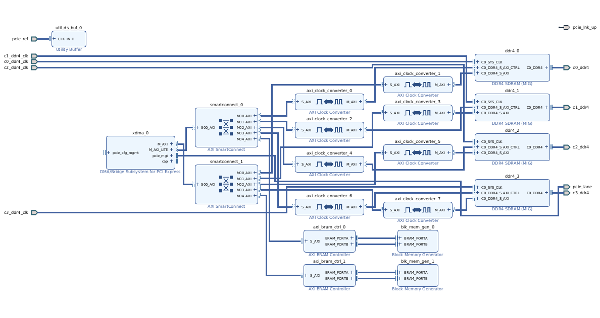
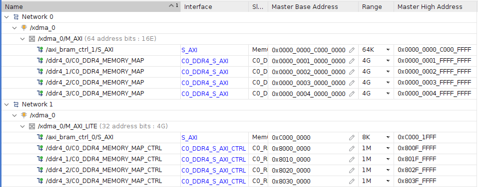
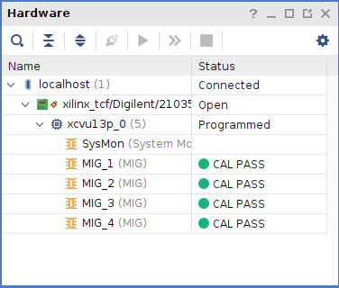
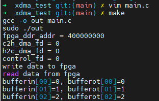

## 国产vu13p 资料

## 如何使用

* 编译工程

目前只支持 prj/02_pcie_ddr4x4 . 有空再全部做成 tcl 脚本。

```shell
cd prj/02_pcie_ddr4x4
vivado -mode batch -source project.tcl
```

```tcl

# 开始编译 
launch_runs synth_1 -jobs 8
wait_on_run synth_1


# 生成bin/bit文件
set_property STEPS.WRITE_BITSTREAM.ARGS.BIN_FILE true [get_runs impl_1]

# 布局布线
launch_runs impl_1 -to_step write_bitstream -jobs 8
wait_on_run impl_1

# 开启GUI
start_gui

```

### 02_pcie_ddr4x4

* 总体结构


* 地址分配

	
* MIG OK


* C OK



## 致谢

* 感谢  章鱼哥  提供部分 DDR4 约束
* 感谢 冻结旋律 提供部分逆向资料
